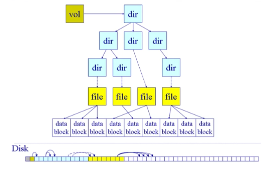
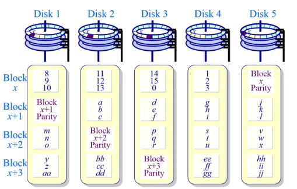

## 概述

shell对外暴露的接口，操作系统对外提供服务

特征
- 并发
    - 同时存在多个运行的程序
- 共享
    - 操作系统控制如何"同时"访问
    - 文件互斥
- 虚拟
    - 让每个用户/程序都觉得有一个计算机专门为它提供服务
- 异步
    - 程序执行不是一贯到底的，向前推进的速度有系统调度
    - 但是只要环境相同，每次运行的结果一定相同
- 相互联系也相互区别


- Microkernel:微内核架构设计
    - 只放基本的功能
    - 文件管理、网路协议栈等都是放在外围以服务的形式存在，服务和服务之间通过内核的消息传递机制
    - 相互隔离，很灵活，小巧
    - 代价就是性能
- 外核设计
    - 内核分成两块，
        - Exokernel(外核)与硬件打交道：完成硬件功能的复制。
        - 建立在exokernel之上，跟具体应用打交道，再通过它访问exokernel，来访问硬件
            - 可对应用进行相应的设计，使得速度更快
            - 完成应用隔离
- 虚拟机
    

## Part 2

- 计算机启动

os存放在硬盘中，需要bootload将它放入内存。bootloader又由bios负责放入内存。
- bios提供各种支持：检测外设，初始化检查，把bootloader放入内存，让它执行
- bootloader：加载os，从硬盘到内存


应用间接与外设打交道，之所以应用不能直接访问外设是因为应用是不可信任的，而操作系统是可信任的;另一方面操作系统外为上层提供一致的接口，使得上层应用不用关注底层细节，通用可移植，提高效率。由此设计一下三个基本概念

- 三个基本概念
    - 中断
        - 产生的源头：外设产生
        - 处理的时间:异步事件，不会知道什么时候产生
        - 响应：持续，对应用程序是透明的
    - 异常
        - 产生的源头：应用意想不到的行为
        - 处理的时间：同步，一定在某个特定的指令可以产生，可以确定时间
        - 响应：杀死或重新执行
    - 系统调用
        - 产生的源头：应用请求操作系统提供服务
        - 处理的时间：同步或异步(返回点有可能是异步的)
        - 响应：等待和持续

- 中断和异常的处理过程
    - 中断码
        - 查表
    - 保存和恢复
        - 程序执行过程中被中断，需要保存当前处理状态，便于恢复后继续执行
- 异常处理过程
    - 保存现场
    - 异常处理
        - 异常编号，相应处理
    - 恢复现场
- 系统调用过程
    - 访问系统调用接口
    - 用户态切到内核态，控制权交给操作系统
        - 用户态：可执行权限低
        - 内核态：可执行任何指令
    - 处理完成后返回成功失败


## Part 3

### 计算机体系结构及内存分层体系

...


### 地址空间与地址生成

- 地址空间
    - 物理地址空间
        - 硬件支持的地址空间
    - 逻辑地址空间
        - 一个运行打程序所拥有的内存范围
- 地址空间生成
    - cpu会根据逻辑地址查找物理地址，对应对应关系储存在MMU的表示映射关系的区域
    - CPU执行某条指令时，ALU根据指令的内容发送请求，携带逻辑地址。CPU中的MMU查找MMU对应的物理地址
    - 逻辑地址和物理地址的联系又操作系统生成
- 检查地址的安全
    - 确保每个程序访问的地址空间


### 连续内存分配：内存碎片与分区的动态分配

- 外碎片
    - 分配单元之间的未使用内存
- 内碎片
    - 在分配单元中的碎片

- 简单的内存管理方法
    - 当一个程序准许运行在内存中时，分配一个连续的区间
    - 分配一个连续的内存区间给运行的程序以访问数据
- 分配策略
    - 首次适配算法
        - 碰到的第一个能够满足需求的空闲块，分配给程序
        - 需求
            - 按照地址排序的空闲地址块列表
            - 重新分配需要检查，看是否有空闲块能够合并
        - 优势
            - 简单
            - 易于把大的空闲块留在结尾
        - 劣势
            - 容易产生外碎片
            - 不确定性
    - 最优适配算法
        - 寻找最适合的空闲块
        - 需求
            - 按照大小排序的空闲地址块列表
            - 重新分配需要检查，看是否有空闲块能够合并
        - 优势
            - 避免了把大的空闲块拆散
            - 最小化外部碎片的产生
            - 比较简单
        - 劣势
            - 重新分配慢
            - 外碎片拆得很细，使得将来的利用可能性小
            - 易产生很多没用的小碎片
    - 最差适配算法
        - 与最优相反，找差距最大的空闲块
        - 需求
            - 按照大小排序的空闲地址块列表
            - 重新分配需要检查，看是否有空闲块能够合并
        - 优势
            - 分配时中等尺寸时效果最小
        - 劣势
            - 易于破碎大的空间，以致于(将来需要时)大分区无法被分配
            - 重新分配慢


### 连续内存分配：压缩式与交换式碎片整理

- 压缩式碎片整理
    - 重置程序以合并孔洞
    - 要求所有程序是动态可重置的
    - 思考：
        - 何时重置
        - 开销
- 交换式碎片整理(swaping)
    - 运行程序需要更多的内存
    - 把硬盘当作内存的备份(虚拟内存)，将等待需求较长的程序挪到硬盘腾出内存
    - 抢占等待的程序&回收他们的内存
    - 思考
        - 那些程序交换
        - 何时换入换出


## Part 4

### 非连续内存分配：分段

- 连续内存分配的缺点
    - 分配给一个程序的物理内存是连续的
    - 内存利用率低
    - 有外碎片和内碎片的问题
- 为什么需要非连续内存分配(优点)
    - 一个程序的物理地址空间是非连续的
    - 更好的内存利用和管理
    - 允许共享代码和数据
    - 支持动态加载和动态链接
- 非连续分配的缺点
    - 管理开销：如何建立虚拟地址和物理地址之间的转换
        - 软件方案
        - 硬件方案
            - 分段
            - 分页

- 分段
    - 段访问机制
        - 程序访问内存需要一个二维数组(段号s，段内偏移addr)
    - 分段的寻址方案
        - 虚拟内存通过某种映射联系到物理地址
        - 需要一个段表，操作系统建立
        - 需要直到段的大小，防止偏移地址超出范围


### 非连续内存分配：页表

页表其实就是一个大数组，每个运行的程序都有一个页表，每个页表有(page num, offset)
- 属于程序运行状态，会动态变化
- PIBR：页表基址寄存器
- 页表内容
    - Flag标志位
        - dirty bit：是否合法
        - resident bit：物理地址中是否存在
        - clock/reference bit
    - 帧号frame num：f
- CPU通过页号和偏移寻址到对应的页表项，把帧号和偏移组合形成物理地址

- 分页机制的性能问题：
    - 访问一个内存单元需要两次内存地址访问
        - 一次获取表项
        - 一次访问数据
    - 页表可能很大，而且为了隔离每个程序要有自己的页表
    - 页表空间大，因此访问效率页会有问题
- 解决办法
    - 缓存近期访问的页帧转换表项(TLB)
        - TLB使用关联内存实现，具备快速访问性能
        - 如果TLB命中，物理页号可以很快获取
        - 如果TLB未命中TLB miss，对应的表项被更新到TLB中
            - 多数编程(访问)的局部性可以降低TLB miss
    - 间接访问


### 非连续内存分配：页表-二级、多级页表

速度问题解决了，空间上如何解决？那就需要页表分级

以二级页表举例，把一块大的页表分成两块，把大的page num分成两块：p1、p2。
通过一级表[p1]找到二级表的地址，在用二级表地址做索引，二级表[p2]找到frame num就可以找到物理地址。

整个过程多了寻址，导致开销增大，但是通过分级，当物理地址不存在时(在一级表就可以得出)，从而二级表不必保存这部分内容。以时间换空间。
    
多级页表同理


### 非连续内存分配：页表-反向页表

前面所讲的页表的大小都和逻辑地址空间的大小有对应关系，逻辑空间寻址的范围越大，页表越多。

- 大地址空间的问题：
    - 有大地址空间(64bits)，向前映射页表变得繁琐
    - 不是让页表与逻辑空间的大小对应，而是让页表与物理地址空间大小对应

有什么办法使得页表项和逻辑地址空间没有那么大的关系，尽量和物理地址空间大小有关？这就是反向页表的想法。

前面都是以逻辑页号来索引页表(一个大数组)，能否用页帧号(物理页号)来查找对应的逻辑页的页号呢？这样就能省很多空间。

基于哈希查找的方案


## Part 5

### 虚拟内存的起因

理想中的存储器：更大、更快、更便宜的非易失性存储器


### 覆盖技术

- 目标
    - 在较小的可用内存中运行较大的程序。常用于多道程序系统，与分区储存管理配合
- 原理
    - 把程序按照自身逻辑结构，划分为若干个功能上相对独立的程序模块，那些不会同时执行的模块共享同一块内存区域，按照时间先后来运行
        - 必要部分(常用功能)的代码和数据常驻内存
        - 可选部分(不常用功能)在其他程序模块中实现，平时存放在外存中，在需要时才装入内存
        - 不存在调用关系的模块不必同时装入到内存，从而可以 **相互覆盖** 即这些模块共享一个分区


### 交换技术

- 目标
    - 多道程序在内存中时，让正在运行的程序或需要运行的程序获得更多的内存资源
- 方法
    - 将暂时不能运行的程序送到外存，从而获得空闲内存空间
    - 操作系统把一个进程的整个地址空间的内容保存到外存中(换出swap out)，而将外存中的某个进程的地址空间读入内存中(换入swap in)。换入换出内容的大小为整个程序的地址空间
- 存在的问题
    - 交换的时机：只当内存空间不够或有不够的危险时换出
    - 交换区的大小：必须足够大以存放所有用户进程的所有内存映像的拷贝
    - 程序换入时的重定位：最好采用动态地址映射的方法


### 虚存技术

- 上面方法的不足
    - 覆盖技术：需要程序员自己把整个程序划分为若干个小的功能模块，并确定各个模块之间的覆盖关系，增加程序员的负担
    - 交换技术：以进程作为交换单位，需要把进程的整个地址空间都换进换出，增加了处理器的开销
- 虚存技术的目标：
    - 像覆盖技术那样，但做的更好，由操作系统完成，不需要程序员的干涉
    - 像交换技术那样，但做的更好，只对进程的部分内容在内存和外存之间进行交换
- 原理：利用程序的局部性
- 基本特征：
    - 大的用户空间：与外存相结合
    - 部分交换：不同于交换技术，可以部分交换
    - 不连续：物理内存分配不连续，虚拟地址空间使用不连续

- 虚拟技术-虚拟页式内存管理
    - 基本思路：
        - 当程序需要调入内存运行时，不是将程序的所有页都装入内存，而是只装如部分页，就可启动程序而运行
        - 在运行的过程中，如果发现运行的程序或要访问的数据不再内存，则发出缺页中断请求，系统在处理这个中断时，将外存中相应的页调入内存，使得程序能够运行

为了事先虚拟页式内存管理，需要在页表项中多加几位：

| 逻辑页号 | 访问位 | 修改位 | 保护位 | 驻留位 | 物理页帧号 |
|----------|--------|--------|--------|--------|------------|

- 驻留位
    - 表示改页是内存还是外存，如果为1,表示在内存中，可以访问，否则导致缺页中断
- 保护位
    - 表示允许对该页做何种类型的访问，如只读、只写等
- 修改位
    - 表示页在内存中是否修改过，当系统回收改物理页时，根据此位来决定是否把它的内存写回到外存(跟新外存的数据)
- 访问位
    - 表明是否访问过。用于置换算法


## Part 6

### 最优页面置换算法

- 功能
    * 当缺页中断发生，需要调入新的页面而内存已满时，选择内存当中哪个物理页面被置换
- 目标
    * 尽可能减少页面换入换出的次数

- 最优页面置换算法
    * 思路：当缺页发生时，选择等待时间最长的那个(将来长一段时间不会发生)，作为置换页面
    * 这一种情况实际无法实现的原因是操作系统无法知道每个页面等待多长时间以后消失。所以只能尽可能接近，作为参考来比较其他算法


### 先进先出算法(FIFO)

- 思路
    * 选择在内存中驻留时间最长的页面并淘汰之。即维护一个链表，链表记录所有的逻辑页，链首表示驻留时间最长。缺页时把链首淘汰，把新页添加到链尾
- 性能较差，并且有Belady现象
    * Belady现象
        + 在采用FIFO算法时，有时出现分配的物理页数增加，缺页率反而提高的异常现象


### 最近最久未使用算法(LRU)

- 思路
    * 缺页发生时，替换最久未被使用的页，并淘汰之
    * 利用局部性原理
- 需要记录使用时间的先后顺序，开销较大。两种可能的实现方法：
    * 维护链表
    * 堆栈，最新的压到栈顶，但是要查找一遍把已经存在的剔除


### 时钟页面置换算法

时钟页面置换算法，LRU的近似，对FIFO的一种改进。

- 基本思路
    * 需要用到表项当中的访问位。当一个页面被装入内存时，把该位初始化为0。如果这个页面被访问到，则把该位置置为1
    * 把各个页面组织成环形链表，指针指向最老的页面
    * 当缺页发生时，考虑指针指向的最老的页面，如果它的访问位为0，则淘汰。如果访问位为1，则把它置为0,然后指针往下寻找


### 二次机会法

时钟页面置换算法的访问并没有区分读还是写。实际中如果执行了写操作dirty bit会置为1，如果只是读dirty bit是0。那么dirty bit有什么用呢？

如果进行的是写操作，那么需要同时写到内存和硬盘(数据一致)。如果是只进行读操作，由于内容并没有改变，只需释放内存，然后换入即可。这种使用两个bit的算法就是二次机会法。

used bit、dirty bit的转变规则如下

| 如果          | 则            |
|---------------|---------------|
| used \| dirty | used \| dirty |
| 0     0       | 替换的页      |
| 0     1       | 0     0       |
| 1     0       | 0     0       |
| 1     1       | 0     1       |


### 最不常用算法(LFU)

- 基本思路
    * 缺页发生时，淘汰访问次数最少的页面
- 维护计数器、顺序


### 局部页面替换算法的问题、工作集模型

如果局部性原理不成立，则各种置换算法效果没有区别。如果局部性原理成立，则可以通过工作集模型来表现。

- **工作集** ：一个进程当前正在使用了逻辑页面集合，可以用一个二元函数$W(t, \Delta)$来表示
    * t是当前的执行时刻
    * $\Delta$称为工作集窗口，即一个定长的页面访问的时间窗口
    * $W(t, \Delta)=$在当前时刻t之前的$\Delta$时间窗口当中的所有页面所组成的集合(随着t的变化， 该集合页不断地变化)
    * $|W(t, \Delta)|$值工作集的大小，即页面数目(不同页面的个数)
- **常驻集** ：当前时刻，进程实际驻留在内存的页面集合
    * 工作集是进程在运行过程中固有的性质，而常驻集取决于系统分配进程的物理页的数目，以及所采用的页面置换算法
    * 当常驻集的大小达到某个数目之后，在给他分配更多的物理页面，缺页率页不会明显下降


``` 
    t: 0 1 2 3 4 5 6 7 8 9 10
pages: a c d c b a a b b d b

若Delta=4, t=5, 则
工作集大小=4(dcba)

若Delta=3, t=8, 则
工作集大小=2(abb)
```


### 全局置换算法

把眼光放到整个系统的所有程序，而不仅仅是专注一个程序的页面置换。程序之间物理页需求不同，操作系统可以进行动态调节。

- 缺页率页面置换算法
    * 可变分配策略：常驻集大小可变。如每个进程刚开始的时候，先根据程序大小给它分配一定数目的物理页面，然而在程序运行中，再动态调节常驻集大小
        + 当一个缺页中断发生时，被置换的页面可以是在其他进程当中。各个并发进程竞争地使用物理页面
        + 优缺点：性能较好，但增加了系统开销
        + 具体实现：可以使用缺页率算法来到动态调整常驻集大小


## Part 7

### 进程控制结构

- 进程控制块：操作系统管理控制进程所需的信息集合
    * 操作系统用 **PCB(Process Control Block)** 来描述进程的基本情况以及运行变化的过程，PCB是进程存在的唯一标志
        + 进程的创建：为该进程生成一个PCB
        + 进程的终止：回收它的PCB
        + 进程的组织管理：通过PCB的组织管理来实现
    * PCB含有以下三大类信息
        + 进程的标识信息
        + 处理机状态信息
        + 进程控制信息
    * PCB的组织方式
        + 链表：经常有动态插入删除的操作系统
        + 索引表(数组)：不常有动态插入删除的操作系统


### 进程的生命周期原理

- 进程创建
    * 引起进程创建的3个主要事件
        + 系统初始化
        + 用户请求创建一个新进程
        + 正在运行的进程执行了创建进程的系统调用
- 进程运行
    * 一个就绪的进程开始运行
- 进程等待
    * 一个进程没有就绪，就进入等待，让其他进程先执行
- 进程唤醒
    * 等待的进程就绪
- 进程结束


### 进程挂起

- 进程挂起
    * 进程没有占用内存空间，叫做进程挂起
    * 阻塞挂起状态：进程在外存并等待某时间的提出
    * 就绪挂起状态：进程在外存，但只要进入内存即可运行
- 状态队列把进程管理起来
    * 一个队列只存一种状态的进程


### 线程管理

线程就是进程中的一条执行流程

- 特性
    * 线程间可以并发执行
    * 线程间共享相同的地址空间
- 优点
    * 一个进程中可以同时存在多个线程
    * 各个线程之间可以并发地执行
    * 各个线程之间可以共享相同地址空间和文件等资源
- 缺点
    * 一个线程崩溃，会导致其所属进程的所有线程崩溃
    * 如：浏览器如果使用一个页面一个进程，则该页面崩溃不会影响其他页面


### 线程的实现

主要有三种线程的实现方式

* 用户线程：在用户空间实现
    + 在用户空间实现的线程机制不依赖于操作系统的内核，由一组用户级的线程库函数来完成线程的管理
    + 操作系统只能感知到线程所属的进程
    + 缺点：
        + 如果一个线程发起系统调用而阻塞，则整个进程进入等待。因为操作系统只能感知到进程，所以操作系统阻塞了进程，导致所有的线程阻塞
        + 当一个线程开始运行后，除非它主动交出CPU的使用权，否则它所在的进程当中的其他线程将无法使用。因为用户进程没有打断线程的特权
        + 由于时间分片分配给进程，故与其他进程比，在多个线程执行时，每个线程得到的时间片少，执行会慢。
* 内核线程：在内核中实现
* 轻量级进程：在内核中实现，支持用户线程
    + 内核支持的用户线程。一个进程可有一个或多个轻量级进程，每个量级进程有一个单独的内核线程来支持


### 上下文切换

各个进程共享CPU资源，不同时刻进程需要切换，让别的进程能够执行。这个切换过程称为进程的上下文切换。


## Part 8

### 调度算法

- FCFS：先来先服务
- SPN(SJF) SRT：短进程优先 短剩余时间优先
    * 可抢占，导致长进程可能一直得不到执行
- HRRN：最高响应比优先
    * $R=(w+s)/s$，w是等待时间，s是执行时间。不可抢占，一定程度防止了长进程得不到执行的问题
- Round Robin：轮循
    * 各个进程轮流占用CPU
    * 会引入额外的上下文切换开销，时间片太小切换太频繁，时间片太大等待时间太久
- Multilevel Feedback Queue：多级反馈队列
    * 不同级别队列可以采用不同的调度方案，根据进程特点划分
- Fair Share Scheduling：公平共享调度


### 实时调度

- 实时系统
    * 定义：正确性依赖于其时间和功能两方面的一种操作系统。即因为是实时的，如果不能在规定时间完成，则失去时效性
    * 强实时系统
        + 需要在保证的时间内完成重要的任务，必须完成
    * 弱实时系统
        + 要求重要的进程优先级更高，尽量完成，非必须
    * 性能指标
        + 时间约束的及时性(deadline)
        + 速度和平均性能相对不重要
    * 主要特征：时间约束的可预测性


### 优先级反转

举个例子：设优先级$T1>T2>T3$，T3先执行并访问一块共享资源(上锁)，但还没解锁CPU就调度去执行T1。当T1也要访问这共享资源时，要等T3使用完毕(解锁)。但这时由于T2优先级高于T3，T2想要执行了，抢占了CPU，那么T1的执行时间被T2延长了。

- 解决办法
    * 优先级继承
        + 低优先级任务继承高优先级任务的优先级依赖于他们共享的资源，即在上面这个例子中，由于T1要等待T3访问完毕，所以T3的优先级得到动态的提升和T1一样。
    * 优先级天花板
        + 资源的优先级和所有可能锁定该资源的任务中优先级最高的那个任务的优先级相同


## Part 9


###  一些概念：

- 临界区：进程中的一段需要访问共享资源并且当另一个进程处于相应代码区域时不会被执行的代码区域
- 互斥：访问临界区的进程只有一个
- 死锁：两个或以上的进程，在互相等待完成待定任务
- 饥饿：一个可执行进程持续得不到执行
- 原子操作：一次不存在中断或者失败的执行(不可在"分"的最小单位，原子)

 
### 同步
     
并发存在的问题：同时对一个数据进行写入操作会存在问题，因为写入操作大致可分为这么几个步骤：读取数据、操作数据、写入数据。由于cpu在线程间切换，如果操作数据后切换到另一个进程，然后才写入数据，将导致问题。

为了解决上面的并发问题，引入互斥锁机制，使得共享的数据一次只能一个进程操作，其他需要等待正在使用的进程使用结束

- 上锁操作执行顺序(也存在上下文切换)问题:
    * 方案一：
        + 1. 判断是否操作共享资源
        + 2. 判断是否有锁
        + 3. 上锁
        + 存在问题，如果A先执行1、2，然后切换到B。B也会成功执行1、2进入3的区域。这时A和B都可以执行3，并没有起到锁的保护机制：只让一个进程操作
    * 方案二：
        + 1. 上锁
        + 2. 判断是否有锁
        + 3. 判断是否操作共享资源
        + 存在问题，A执行了1二话不说先上锁，然后切换到B。B也二话不说先上锁，这时A和B都被对方锁住，谁都不会执行
        + 这种由于进程切换导致谁都不执行的现象称为饥饿
    * 方案三：使用临界区


### 临界区的创建

- 禁用硬件中断
    * 虽然在临界区中执行时不会被随意切换了，但对于外设的事件也得不到相应
    * 而且对于多核CPU，要屏蔽所有CPU的相应中断能力，所在多CPU情况下无法解决互斥问题
- 基于软件的解决方法
    * 设有两个线程T0、T1,它们的结构通常为`while(1){进入临界区;执行临界区代码;退出临界区}`
    ``` c
    int turn;  // 指示该谁进入临界区
    bool flag[];  // 指示进程是否准备好进入临界区
    while(1){
        // 进入临界区的代码
        flag[i] = TRUE;
        turn = j;
        while(flag[j]&&turn==j);
            //操作
        // 退出临界区的代码
        flag[i] = FALSE;
    }
    ```
- 更高级的抽象：基于硬件的一些原子操作
    * Test-and-Set：这是一条完成读和写的机器指令
        + 1. 从内存读值
        + 2. 测试该值是否为1(返回bool)
        + 3. 内存值设置为1
    * 交换exchange
        + 交换两个内存中的值
    * 上面两条指令都是原子操作，不会被切换、中断
    * 缺点：
        + 忙等消耗处理器时间
        + 当进程离开临界区并且多个进程在等待的时候可能导致饥饿(抢lock抢不到)
        + 死锁：如果一个低优先级的进程拥有临界区并且一个高优先级进程也要求，那么高优先级进程会获得处理器并等待临界区


## Part 10

### 信号量

- 抽象数据类型
    * 一个整形(sem)，两个原子操作
    * P()：sem减1,如果sem<0，等待，否则继续
    * V()：sem加1,如果sem<=0(说明有有一些进程在等待)，唤醒一个等待的P
     

#### 信号量的使用

- 信号量是整数
- 信号量的被保护的变量
    * 初始化完成后，唯一改变一个信号量的值的方法是通过P()和V()
    * 操作必须是原子
- P()能够阻塞，V()不会阻塞
- 我们假定信号量是"公平的"
    * 没有线程被阻塞在P()仍然堵塞V()被无限频繁调用(在同一信号量)
- 两种类型信号量
    * 二进制信号量：可以是0或1
    * 一般/计数信号量：可是任何非负数
        + 允许多个执行P操作的进程进入后续操作

``` 
mutex->P()
临界区
mutex->V()
```


#### 信号量的实现

基本结构

``` c
class Semaphore{
    int sem;
    WaitQueue q;
}

Semaphore::P(){
    sem--;
    if(sem<0){
        把这个线程放入等待队列q;
        block(p);
    }
}

Semaphore::V(){
    sem++;
    if(sem<=0){
        从等待队列中取出一个线程t
        wakeup(t);
    }
}
```


### 管程

building


- 目的：分离互斥和条件同步的关注
- 什么是管程：
    * 一个锁：指定临界区
    * 0或多个条件变量：等待/通知信号量用于管理并发访问共享数据
- 一般方法
    * 收集在对象/模块中的相关共享数据
    * 定义方法来访问共享数据


## Part 11

 **IIII** 

### 死锁的特征

- 互斥：在一个时间只能有一个进程使用资源
- 持有并等待：进程保持至少一个资源正在等待获取其他进程持有的额外资源
- 不抢占：一个资源只能被进程自愿释放
- 循环等待：一个等一个的环，但有环不一定有死锁


### 死锁处理办法

#### 死锁预防

死锁出现我们将死锁出现的某个条件打破是不是就解决了?

- 打破占用并等待
    * 一次占用所有所需的资源否则就不拿资源，是不是就防止了其他进程插足
        + 缺点是资源利用率低，可能发生饥饿
- 打破不抢占
    * 过于极端，导致被抢占的进程无法正常运行
- 打破循环等待
    * 对所有资源类型进行排序，并要求每个进程按照资源的顺序进行申请


#### 死锁避免

申请资源时进行判断是否会出现死锁。需要操作系统提供一些额外的先验信息：
- 最简单的方法如：每个进程声明它可能需要的每个类型资源的最大数目
- 限制提供与分配的资源数量，不能超过个某个最大需求
- 死锁避免算法动态检查资源分配状态，以确保永远不会有一个环形等待状态
    * 但是有环并不一定有死锁


#### 银行家算法

> 有人找银行家贷款，银行家判断是否能够贷款收回，能收回才放贷。

- 前提条件
    * 多个进程实例
    * 每个进程必须最大限度利用资源
    * 当一个进程请求资源，得不到就不等待
    * 当一个进程得到所有的资源就必须在一定的时间内释放

基于上述条件，银行家算法通过寻找允许每个进程获得的最大资源并结束的进程理想执行时序，来决定是否安全。不存在满足要求的执行时序状态都是不安全的。

- 数据结构
    * n = 进程数量，m = 资源类型数量
    * Max(总需求量)：n x m矩阵。Max[i, j] = k表示，进程$P_i$最多请求资源类型$R_j$的实例个数为k
    * Available(空闲量)：长度为m的向量。Available[j] = k表示有k个$R_j$类型的资源可用
    * Allocation\[i, j\](已分配)
    * Need\[i, j\](未来需要量)
    * Need[i, j] = Max[i, j] - Allocation[i, j]

- 1. 初始化
    ``` 
    // work和finish分别是长度为m和n的向量
    work = Available  // 当前剩余
    finish[i] = false for i in range(n) // 线程i没结束
    ```
- 2. 判断能否申请到：找到need比work小的进程i
    ``` 
    // 要求
    (a) finish[i] = false
    (b) need_i <= work
    ```
    * 没找到跳转到4
- 3. 申请到后认为进程可以正常结束
    ```  
    // 进程i的资源要求量小于当前的剩余空闲资源量
    work = work + allocation  // 回收
    finish[i] = true
    ```
    * 跳转到2
- 4. 如果步骤2找不到这样的进程
    ``` 
    if finish[i] == true for all i  // 表明安全状态
        可以分配
    else 不应该分配
    ```

#### 死锁检测和死锁恢复

- 死锁检测
    * 维护等待图
        + 节点是进程
        + $P_i \rightarrow P_j$：Pi等待Pj
    * 定期调用检测算法来搜索图中是否存在循环
    * 算法需要$n^2$次操作，n是图中定点的数目
    * 开销比较大
- 死锁恢复
    * 终止所有的死锁进程
        + 比较暴力
    * 在一个时间内终止一个进程直到死锁消除
        + 基于进程的优先级
        + 基于进程运行需要的时间
        + 基于进程的资源占用
        + 基于进程需要的资源
        + 基于进程需要被终止的数目
        + 基于进程是交互还是批处理
    * 资源抢占


### IPC(进程间通信:Inter-Process Communication)

- 直接通信
    * 自动建立链路
    * 一条链路恰好对应一对通信进程
    * 每对进程之间只有一个连接存在
        + 打破进程间的隔离
- 间接通信
    * 定向从消息队列接收消息
- 信号
    * 类似与中断信号，但在IPC中是基于软件的信号
    * 实现：
        + 在程序中编写handler负责处理操作系统发出的信号
        + 收到信号后操作系统把本来应该向下执行的地址改为信号处理函数的入口地址
    * 进程可以接收、可以忽略
    * 不足是信号不传参数，只是信号(某种标记)
- 管道pipe`a | b`
    * 用于数据交换，通过父进程帮子进程建立好通道
    * 把a的输出放入缓冲区buffer，把这个缓冲区的内容当作b的输入
- 消息队列
    * 不同于管道
        + 没有父子关系
        + 管道里数据是一种字节流，不是一种结构化的数据
- 共享内存
    * 一种直接通信方式，共享内存
    * 优点：快速，方便的共享数据
    * 缺点：必须同步数据访问，需要同步互斥机制


## Part 12

### 文件系统

#### 文件描述符

- 内核跟踪每个进程打开的文件
    * 操作系统为每个进程维护一个打开文件表
    * 一个打开文件描述符是这个表中的索引
- 需要元数据来管理打开文件
    * 文件指针：指向最近一次读写位置，每个打开这个文件的进程都有这个指针
    * 文件打开计数器：记录文件打开的次数。当最后一个进程关闭了文件时，允许将其从打开文件表中移除
    * 文件磁盘位置：缓存数据访问信息
    * 访问权限


#### 目录

目录好比一个集合，这个集合里有很多文件。集合用何种数据结构实现取决于文件系统的设计。可以采取传统的数组形式、、链表形式、也可采取哈希表形式或者更复杂的形式。


#### 文件别名

- 多个文件名关联同一个文件
    * 硬连接：多个文件指向一个文件
        + 删除一个文件将减少文件的引用计数，只有引用计数为0时才会删除一个文件
    * 软连接：以"快捷方式"指向其他文件
        + 删除真实文件后会留下的快捷方式将指向空
    * 通过存储真实文件的逻辑名称来实现
- 别名机制潜在的循环
    * 对目录的别名：子目录是父目录的一个引用
    * 这将导致查找文件时检索路径出现死循环


#### 文件系统类别

- 磁盘文件系统
    * 文件存储在数据存储设备上，如磁盘
    * 例如：FAT、NTFS、ext3/4等
- 数据库文件系统
    * 文件根据其特征是可寻址(辨识)的
- 日志文件系统
    * 记录文件系统的修改/时间
- 网络/分布式文件系统
- 特殊/虚拟文件系统


#### 文件系统的实现

文件系统的种类繁多，如果让操作系统针对不同的文件系统编写应用程序，这显然是很复杂的。所有操作系统把复杂的东西抽象成简单的接口提供给用于，用户只需访问简单的接口，就可以应对不同的文件系统。

虚拟文件系统是一个内存中的概念，通过虚拟文件系统层，屏蔽了底层文件各种系统的差异，从而应用程序可以访问不同类型的文件系统。

- 分层结构
    * 上层：虚拟(逻辑)文件系统
    * 底层：特定文件系统模块
- 目的
    * 对多有不同文件系统的抽象
- 功能
    * 提供相同的文件和文件系统接口
    * 管理所有文件和文件系统关联的数据结构
    * 高效查询例程，遍历文件系统
    * 与特定文件系统模块的交互

- 基本结构
    * 卷控制块
        + 每个文件系统一个
        + 文件系统详细信息
        + 块、块大小、空余块、计数/指针等
    * 文件控制块
        + 每个文件一个
        + 文件详细信息
        + 权限、拥有者、大小等信息
    * 目录节点
        + 每个目录项一个(目录和文件)
        + 将目录项数据结构及树形布局编码成树形数据结构
        + 指向文件控制块、父节点、项目列表等




### 打开文件的数据结构

- 将文件控制块读入内存
- 相关信息放入打开文件表
- 把打开文件表表项的索引返回给应用程序
    * 基于索引找到系统层面的打开文件表。由于可能多个程序打开同一个文件，所以都索引到系统文件表(只有一项)就ok
    * 系统文件表由索引到目录/文件
    * 如：访问文件，那么文件的信息会包含文件出现在什么地方(disk位置)，然后由偏移量指出，转换成disk扇区的编号
    * 然后就可对扇区内容读写


### 文件分配

当要写入文件时，要对文件的数据空间进行管理(增减)。分配方式有如下几种
* 连续分配
    + 文件头指定起始块和长度
    + 位置/分配策略
        + 最先分配、最佳分配
    + 优势
        + 文件读取表现号
        + 高效的顺序和随机访问
    + 劣势，同数组的劣势
        + 文件增长问题，可能需要调整后面一系列文件，或者把自己移动到别处，但这样又造成碎片问题
        + 碎片
* 链式分配
    + 文件以数据块链表方式储存
    + 文件头包含了到第一块和最后一块的指针
    + 优点
        + 创建、增减很容易
        + 没有碎片
    + 缺点
        + 不可能进行真正的随机访问
        + 可靠性：如突然断电一个链被破坏...
* 索引分配
    + 为每个文件建立一个名为 **索引数据块** 的非数据数据块
        + 到文件数据块的指针列表
    + 文件头包含了索引数据块
    + 优点
        + 创建、增减容易
        + 没有碎片
        + 支持直接访问
    + 缺点
        + 当文件很小时，存储开销比例大
        + 如何处理大文件？一个索引块能够描述的数据块的个数是有限的
            + 分级处理，但是引入很多(索引)开销，和链被破坏的问题


### 空闲空间列表

对空闲空间的管理。有如下几种管理方式

- 用位图代表空闲数据块列表
    * `11110001110011`每个位就可表示扇区是否被分配
        + 如果i=0表明数据块i是空闲的
    * 使用简单，但是可能会是一个big vector
        + 如160G的disk需要5MB的bit表示，可以将这5M读取到内存
        + 然而如果空闲空间中均匀分布，那么在找到0之前需要扫描n/r。n表示磁盘数据块的总数，r表示空闲块数目
    * 需要保护数据一致性：储存在内存的位图需要和硬盘的位图一致
        + 解决办法：先在硬盘位图上修改，再分配，在修改内存的位图。不会出现数据丢失的情况
- 链式列表
- 分组列表


### 多磁盘管理-RAID

通常磁盘通过分区来最大限度减小寻道时间

- 分区：不同分区可以是不同的文件系统
- 卷：把多个磁盘变成一个卷来管理，这就可以把一个文件系统扩展到，多个磁盘

**RAID：冗余磁盘阵列** 。早期的磁盘容易坏，那么能不能用多个磁盘来储存一个文件系统的内容来保证可靠性呢？raid由此提出。后来raid又可以用来提升磁盘访问的吞吐量，提高访问速度。

- 实现
    * 在操作系统内存：储存/卷管理。软raid
    * raid硬件控制器。硬raid
- raid0：提高吞吐量
    * 每个磁盘的独立的，可以并行的对数据进行访问，提升吞吐量
- raid1：提高可靠性
    * 每个磁盘的独立的，可以并行的操作
- raid4：即提高性能又增加可靠性
    * 如：使用一块Parity Disk的盘存储校验码，其他盘可以做并行操作。这样当一块盘的数据坏时可以反推出损坏的数据
- raid5：raid4中Parity Disk的读写非常频繁，开销大
    * 把校验块均匀的分配在不同的disk中，开销均匀、访问并行
    * 


