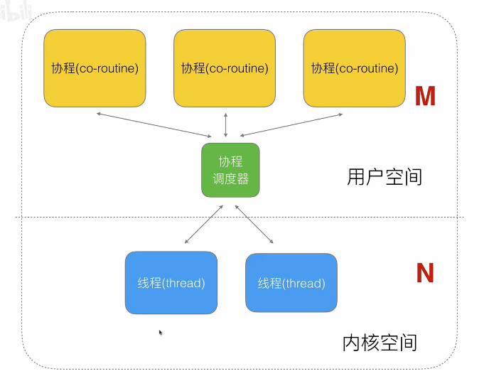

## go工具使用

- `go <command> [arguments]`
    * build, 编译
    * install，区别与build，install会编译后将输出文件打包成库放在pkg下
    * fmt，把所有代码标准化/格式化编码风格
    * test，运行当前包目录下的tests
        + 一般以`XXX_test.go`位文件名


### Test写法

- 每个test文件必须引入`testing`
- test文件下的每一个test case必须以Test开头并符合TestXxx形式，否则go test会直接跳过测试不执行
- `test case`的入参为`*testing.T`或`b *testing.B`
    * `T`普通入参
    * `B`如果是测试性能的test
- `t.SkipNow()`跳过当前test，并且直接PASS处理，继续下一个test
    * 必须写在第一行
- test的顺序
    * go并不会保证多个TestXxx是顺序执行的，但通常是顺序执行
    * 使用`t.Run`来执行subtests可以做到控制test输出以及test顺序
    * 使用TestMain作为初始化test，并使用`m.Run()`来调用其他tests可以完成一些需要初始化的testing，比如数据库连接，文件打开等


#### Test之benchmark

`go test -banch=.`

- benchmark函数一般以Benchmark开头
    * `func BenchmarkXxx(b *testing.B)`
- benchmark的case一般会跑b.N次，而且每次执行都会如此
- 在执行过程中会根据实际case的执行时间是否稳定增加b.N的次数以达到稳态
    * 由于b.N会动态改变，所以要测试的函数必须是有稳态的，否则bench可能不会停止


## 杂项

###  字符串变量结构

- 不同于C语言字符串以`\0`结尾，golang字符串中的字符可以是任何字符，因为它的结构为: `| data | len |`
- 因此你可以像这样`str[2]`读取字符串内容，但不能修改它


### 切片

slice有三个部分

- data(元素存哪里)
- len(存了多少)
- cap(可以存多少)
- 因此slice结构为 `| data | len | cap |`

``` go
var ints[]int = make([]int, 2, 5)
ints = append(ints, 1)

ints: | data | 3 | 5 |

| 0 | 0 | 1 | 0 | 0 |
```

当使用new创建字符串切片如`ps := new([]string)`，会分配一个slice的三部分结构`| data=nil | 0 | 0 |`，返回值就是slice的起始地址。但它不负责底层数组的分配，所以ps指向nil

通过`append(*ps, "hello")`添加元素，它就会slice开辟底层数组(上节说的string结构)

但是slice不是必须指向数组的开头，因为我们可以把不同是slice关联到同一个数组`arr[a:b]`，他们会共用底层数组

``` go
arr := [7]int{0, 1, 2, 3, 4, 5, 6}
// arr 是一个长度为7的int数组
var s1 []int = arr[1:4]
var s2 []int = arr[3:]

//左闭右开，则s1结构为
| data | 3 | 6 |  // 可以继续添加元素
// s2为
| data | 4 | 4 |  // 如果继续添加元素，则开辟新数组并拷贝原数据
```

slice扩容的步骤：

- 根据slice的扩容规则，预估
    * 如果扩容前(oldLen)翻倍还是小于所需最小容量(cap)，则新容量(newCap)等于最小容量
    * 否则
        + 如果oldLen < 1024 , 直接翻倍newCap = oldCap x 2
        + 否则扩1/4，newCap = oldCap x 1.25
- 分配内存
    * golang的内存管理模块会提前申请好一部分常用规格的内存，如8、 16 ...字节
    * 然后分配最接近需求的内存


### 内存对齐

[building](https://www.bilibili.com/video/BV1Ja4y1i7AF)

因此好的go程序结构体字段的顺序也是有讲究的


### 闭包

go将作为参数、函数返回值、绑定到变量的函数称为 **Function Value** ，Function Value本质上是个指针，但不直接指向函数入口，而是指向一个`runtime.funcval`结构体，这个结构体里只有一个地址，就是这个函数的入口地址。

``` go
type funcval struct{
    fn uintptr
}
```

编译器会为同一个函数的Function Value指定相同的funcval。

Golang使用funcval接口体包装函数地址的原因：为了处理闭包的情况。举个闭包的例子

``` go
func create() func()int{
    c:=2
    return func() int {
        return c
    }
}
```

c这样的变量称为 **捕获变量** 。闭包对象在运行时是才创建。当一个变量接受调用时，如`f1 := create()`会在堆中创建一个funcval结构体和捕获变量列表。当另一个变量调用时又生成另一个funcval和捕获变量列表。这样每个闭包的状态(捕获变量)可能有所不同，这就是为什么称闭包为有状态的函数。

有了funcval的结构就可以通过funcval的指针找到函数入口，通过与funcval的偏移量找到捕获变量。

#### 变量逃逸

考虑捕获的变量处理初始化外还被修改的情况

``` go
func create() (fs [2]func()){
    for i:=0; i<2; i++{
        fs[i] = func(){
            fmt.Println(i)
        }
    }
    return
}

func main(){
    fs := create()
    for i:=0; i<len(fs); i++{
        fs[i]()
    }
}
```

结果输出都是2，原因如下。

在`create()`函数中，因为i被闭包捕获，局部变量i改为堆分配，在create函数的栈中值保存i的地址(&i)。第一次for创建funcval和捕获列表(i的地址)，这样闭包函数就和外层函数操作同一个变量，第二次for循环仍是funcval和i的地址。因为操作的是同一个变量，而闭包函数捕获的是i的地址，所以两次输出的结果其实都是create堆分配中的i(2)。

闭包导致的局部变量堆分配就是变量逃逸的一种场景。闭包这么做是为了保持捕获变量在外层函数与闭包函数中的一致性。


### defer

defer会在函数结束前倒序执行。

``` go
func A(){
    defer B()
    // do something
}
```


#### Go 1.12

在go1.12中编译后伪代码结构为：

``` go
func A(10){
    r = deferproc(8, B)
    if r>0 {  // if panic
        goto ret
    }
    // do something
    runtime.deferreturn()
    return
ret
    runtime.deferreturn
}
```

- deferproc把要执行的函数信息保存起来，称之为 **defer注册** 
    * `func deferproc(size int32, fn *funcval)`, size指出defer函数的参数加返回值共占多少空间
- runtime.deferreturn执行注册的defer函数
    * 这样的先注册后调用来实现延迟执行
    * defer信息会注册到一个链表，而当前执行的goroutine会在堆中创建一个`_defer`结构体，其中一个属性持有链表的头指针，新插入链表头，因此是后进先出，defer倒序执行

``` go
type _defer struct{
    siz     int32    // 参数和返回值共占多少字节
    started bool     // 是否已执行
    sp      uintptr  // 调用者栈指针
    pc      uintptr  // 返回地址
    fn      *funcval // 注册的函数
    _panic  *_panic 
    link    *_defer  // next_defer
}
```

Go语言会预先分配一块大小的\_defer池，需要defer时选择合适的取出，否则再进行堆分配。这样避免了频繁的堆分配//回收。

这个go1.12版本的defer存在的问题就是慢：
- 1. \_defer在堆分配，使用时要在堆和栈间来回拷贝
- 2. 链表本身的操作就比较慢


#### go1.13的优化策略

在go1.13中编译后的伪代码结构为：

``` go
func A(){
    var d struct{
        runtime._defer
        i int
    }
    d.siz = 0
    d.fn = B
    d.i = 10
    r := runtime.deferprocStack(&d._defer)
    if r>0 {
     goto ret
    }
    //do something
    runtime.deferreturn()
    return
ret:
    runtime.deferreturn()
}
```

1.13中通过增加d结构体这样的局部变量把defer信息保存在当前函数栈帧的局部变量区域，再通过deferproc把d这个结构体注册到defer链表中

减少的defer信息的堆分配，\_defer也新增了`heap bool`的字段来表示是否为堆分配


#### go1.14中defer的优化策略

通过在编译阶段插入代码，把defer的执行逻辑展开在所属函数中，从而不需要创建\_defer结构体和defer链表

``` go
func A(i int){
    defer A1(i, i*2)
    if(i > 1){
        defer A2()
    }
    return
}
```

编译时defer函数如A1，所需的参数以局部变量的形式保存在所属函数中，然后在函数末尾插入`A1(保存的局部变量)`

但像A2这样执行阶段才知道是否需要执行的defer函数怎么能直接插入呢？

使用一个标识位`var df byte`每一位表示一个defer函数是否会执行，使用或运算来修改df标记位的信息。因此上述函数对应的编译后伪代码为：

``` go
func A(i int){
    var df byte
    //defer是否需要执行的标记位
    var a, b int = i, i*2 
    var m, n string = "hello", "ring"
    //局部变量保存defer函数的参数
    df |= 1 //defer函数A1必定会执行，所以直接
    if i>1 {
        df |= 2  //defer函数A2可能会执行，runtime才知道
    }
    if df&2 > 0 {
        df = df&-2 //-2表示非2, 清零
        A2(m, n)
    }
    fi df&1 > 0 {
        df = df&-1
        A1(a, b)
    }
    return
}
```

官方称之为open coded defer

1.13和1.14中的defer都不适用于循环中的defer，循环中的defer需要使用1.12版本的defer，因此都会有`heap bool`的标记

但是1.14中的如果遇到panic，那么后面的defer将无法继续执行，又因为这样的open coded没有注册到链表，所有需要额外的栈扫描来发现。

1.14中defer更快了，但panic更慢了。但是defer发生的概率比panic大得多


### panic和recover

上面defer章节说道每个goroutine有个`_defer`结构体，其实也有一个`_panic`结构体，里面包含panic链表的头指针。

和defer一样发生新的panic时在头部插入新的panic结构体

当发生panic时，后面的代码将不会继续执行，而是根据panic跳转，然后执行defer链表。

执行defer时，会将`started`字段赋为true，把`_panic`字段指向当前的panic。如果defer函数能够正常结束，则移出defer链表执行下一个defer。

如果defer不能正常结束，后面的代码页不会执行，在panic链表插入新的panic，称为当前执行的panic，然后同样取执行defer链表。但是发现`started`字段是true，于是根据记录的`_panic`指针找到对应的panic，把它标记为已终止。

``` go
type _panic struct{
    argp      unsafe.Pointer // 当前要执行的defer的函数参数地址
    arg       interface()    // panic的参数
    link      *_panic        // 之前的panic
    recovered bool           // 表示panic是否被恢复
    aborted   bool           // 表示panic是否被终止
}
```

之后打印panic信息，从链表尾开始，即panic发生的顺序输出。


#### 有recover发生的panic

recover函数把panic的`recovered`字段设为true

``` go
func A(){
    defer A1()
    defer A2()
    // ..
    panic("panicA")
    // ...
}

func A2(){
    p := recover()  // 把当前的panic置为已恢复
    fmt.Println(p)
}
```

每个defer执行完后都会检查当前panic是否被恢复，如果panic已恢复，则从链表中移除


### Map

Go语言中Map的底层实现是哈希表。map类型本质上是个指针\*hmap

go语言哈希桶的选择采用的是与运算的方式，所以桶的个数m必须的2的次幂，这样m-1将得到`000111`的结构。因此`bucket = hash & (m-1)`

``` go
type hmap struct{
    count      int   // 已经存储的键值对数目
    flags      uint8 
    B          uint8 // 记录桶的数目是2的多少次幂  
    noverflow  uint16
    hash0      uint32
    buckets    unsafe.Pointer   // 记录桶的位置
    oldbuckets unsafe.Pointer   // 记录旧桶的位置
    nevacuate  uintptr          // 即将迁移的旧桶编号
    extra      *mapextra // 记录溢出桶相关信息，桶满了链溢出桶，减少扩容次数
}
```

map的扩容规则：
- 如果负载因子(LoadFactor)超标：count/(2^B) > 6.5
    * 翻倍扩容
- 如果负载因子没有超标，但溢出桶(noverflow)较多(很多键值对被删除的情况)
    * (B<=15 && noverflow >= 2^B) || (B>15 && noverflow >= 2^15)
    * 等量扩容：创建和原来一样多的桶，把原数据迁移过去


### Method

创建一个类型A，并为他关联一个方法，如`func (a A)Name() string{}`。则可以通过类型A的变量来调用`a.Name()`。这种调用方式其实是语法糖，相当于`A.Name(a)`，a就是方法接收者，作为方法的第一个参数传入。

go语言中，函数类型只与参数和返回值相关。所以对于下面的方法和函数：

``` go
func (a A)Name() string{ // method
    return a.name
}

func NameOf(a A) string{
    return a.name
}

func main(){
    fmt.Println(reflect.TypeOf(A.Name)==reflectTypeOf(NameOf))
}
```

如果上述的方法和函数类型值相等，则说明  **方法本质就是普通函数，方法接收者就是隐含的第一个参数** 

这样就解释值接收者和指针接收者了:
- `func (a A)Name()`则：
    * `a.Name()` = `A.Name(a)`
- `func (a *A)Name()`则：
    * `pa = &a; pa.Name()` = `(*A).Name(pa)`，方法接收者是指针

但是 **可以通过值接收者调用指针接收者的方法;通过指针接收者调用值接收者的方法** 是什么意思？

这些其实也是语法糖。因为编译阶段会自动转换成需要的形式。如指针接受者调用值接收者的方法，编译成`(*pa).Name()`的形式


### 接口

#### 类型系统

反射、接口动态派发、类型断言该如何获取数据类型信息呢？

- 给内置类型定义方法是不允许的
- 接口类型是无效的方法接收者

所以不会给内置类型或接口类型定义方法。

不管是内置类型还是自定义类型，都有对应的描述信息，称为`类型元数据`。每种类型的类型元数据都是全局唯一的。类型元数据的结构`runtime._type`如下

``` go
type _type struct{
    size       uintptr
    prtdata    uintptr
    hash       uint32
    tflag      tflag
    align      uint8
    fieldalign uint8
    kind       uint8
    ...
}

此外还有各种类型额外需要描述的信息
```

`type MyType1 = int32`中`MyType1`和`int32`关联到同一个类型元数据，属于同一类型。而`type MyType2 int32`属于自定义类型`MyType2`会创建新的类型元数据，虽然和int32没有区别

#### 空接口

空接口类型可以接收任何类型的数据

``` go
// interface{}
type runtime.eface struct{
    ...
    _type *_type  //指向动态类型元数据
    data unsafe.Pointer  // 指向动态值
    ...
}
```

当用空接口接收一个类型时，`_type`就会指向该类型的类型元数据，里面就要我们常用的描述信息;`data`将指向该类型的值


#### 非空接口

一个变量要赋值给非空接口类型，必须实现改接口要求的所有方法。

``` go
// 非空接口
type iface struct{
    tab *itab
    data unsafe.Pointer  // 同空接口
}
```

接口要求的方法列表、接口动态类型信息都存储在`itab`结构体里：

``` go
type itab struct{
    inter *interfacetype // 指向interface的类型元数据，方法列表就在其中
    _type *_type  // 接口的动态类型元数据
    hash  uint32  // 动态类型元数据中拷贝的类型哈希值
    _     [4]byte 
    fun   [1]uintptr  // 实现的接口要求的方法地址
}
```

用到的itab结构体会被缓存起来，通过 接口类型和动态类型组合起来的key找到对应的itab指针


#### 类型断言

[Ref](https://www.bilibili.com/video/BV1iZ4y1T7zF?p=3)

REVIEW!!

`接口.(具体类型)`

- 空接口.(具体类型)
    * 如`e.(*os.File)`，只需判断e的`_type`是否指向`*os.File`的类型元数据即可
    * `r, ok := e.(*os.File)`，ok=true，r被赋值为e的动态值，否则r被赋类型零值
- 非空接口.(具体类型)
    * 通过接口类型和动态类型组合起来的key找到对应的itab指针


### 反射

为了把类型原数据暴露给用户使用，需要反射机制。

上章提到类型元数据储存在`runtime._type`下，但是是未导出的，所以在`reflect`包下定义的同样的`type`结构。两者是一样的。


#### 通过反射获取类型信息

`reflect`包中有`TypeOf`函数(`reflect.TypeOf`)用于获取一个变量的类型信息，接收空接口，返回`reflect.Type`类型

``` go
func TypeOf(i interface{}) Type{
    eface := *(*emtpyInterface)(unsafe.Pointer(&i))
    return toType(eface.typ)
}
```

`Type`类型中提供了很多方法，用于获取类型信息，如`t.Name()`等。

``` go
func main(){
    a := youpkg.youType{Key: "value"}
    t := reflect.TypeOf(a)
    fmt.Println(t.Name())
}
```

- 传递空接口需要传递它的地址
- go语言传参数都是值拷贝

那为何`reflect.TypeOf(a)`可行呢？因为编译器做了优化，增加了一个临时变量作为a的拷贝，然后参数其实使用的是这个临时变量的地址。

**所有参数为空接口的情况，都是这样传递拷贝后变量的地址** 


#### 通过反射修改变量值

`reflect`包中的`Value`类型:

``` go
type Value struct{
    typ  *rtype         // 反射变量的类型元数据指针
    ptr  unsafe.Pointer // 数据地址
    flag //             位标识符，存储反射值的一些描述
}
```

通常使用`reflect.ValueOf()`来获取一个`reflect.Value`，这个函数的参数也是空接口，和`TypeOf`处理参数的方式一样，但是`ValueOf`会显式的将参数指向的变量逃逸到堆上。

一个通过反射修改变量的例子

``` go
// WRONG
func main() {
    a := "ring"
    v := reflect.ValueOf(a)
    v.SetString("hello ring")
}

// CORRECT
func main() {
    a := "ring"
    v := reflect.ValueOf(&a)
    v = v.Elem()
    v.SetString("hello ring")
}
```

上面的错误示范中，由于向`ValueOf()`直接传值，而这种的传递方式在上面`TypeOf`中说过，是创建一个临时的拷贝，所以修改的也将是临时的拷贝。所以会报错。所以需要反射a的指针。

`v = v.Elem()`拿到`v.ptr`指向的变量a，并包装成`reflect.Value`类型


## GMP

GMP: G for goroutine协程、M for thread 线程，P for processor处理器

线程越多，CPU在调度上的花销越大，而且多线程也伴随着资源的竞争问题、高内存占用问题。

- 多进程、线程的壁垒
    * 高内存占用
        + 进程约2G
        + 线程约4M
    * 高CPU调度消耗

一个线程有用户空间(态)和内核空间(态)。内核空间中跑内核线程，操作硬件资源；用户空间中跑用户线程，操作业务逻辑。内核线程和用户线程会进行绑定，即业务逻辑和资源分配绑定。

用户线程就是协程(co-routine)，内核线程就是线程(thread)。


### M:N的多线程模型

多个线程通过协程调度器控制多个协程，协程降低的cpu调度的成本，当一个协程阻塞时可以切换另一个线程进行操作。



这么一来优化只需要关注优化协程调度器


- Golang对协程的处理
    * 协程(co-routine)改为Goroutine
    * 内存只占几KB
    * 灵活调度，切换成本低


### GMP模型

- 全局队列
    * 存放等待运行的G
- P的本地队列
    * 存放等待运行的G
    * 一般不超过256个G
    * 优先将新创建的G放到P的本地队列，如果满了放全局队列
- P列表
    * 程序启动时创建
    * 最多GOMAXPROCS个
        + 修改环境变量\$GOMAXPROCS
        + 或使用`runtime.GOMAXPROCS()`设置
- M列表
    * 当前操作系统分配到当前Go程序的内核线程数
    * 当一个M阻塞/空闲，就创建/释放一个M


### 调度器的设计策略

- 复用线程
    * work stealing机制
        + 当一个P空闲时，可以从忙碌的P的队列中偷取一个G来执行
    * hand off机制
        + 当P阻塞时，将它的P本地队列中的G交给别的P处理或创建新的P来处理
- 利用并行
    * 利用多核
- 抢占
    * 不用等待主动释放cpu，一定时间自动释放，再抢占
- 全局G队列
    * work stealing从其他P偷不到时，从全局队列获取


### go指令的调度流程

- 1. `go func()`创建一个G
- 2. G加入队列
    + 优先加入当前P的本地队列
    + 如果已满，则放入全局队列
- 3. 若P的本地队列空，则从全局队列获取G。如果全局队列也空则从别的P队列获取
- 4. 调度
- 5. 执行
    * 10ms后放回队列，直到func执行完毕
    * 如果阻塞，则hand off，解阻塞后放到全局队列


### 调度器的生命周期

- M0
    * 启动程序后的编号为0的主线程
    * 在全局变量runtime.m0中，不需要在heap上分配
    * 负责执行初始化操作和启动第一个G
    * 启动第一个G之后，M0和其他M一样了
- G0
    * 每次启动一个M，都会创建的第一个Goroutine
    * 仅用于负责调度的G
    * 不指向任何可执行的函数
    * 每个M都有自己的G0
    * 在调度时会使用M切换到G0来调度


### GMP终端debug调试

`GODEBUG=schedtrace=1000 ./executable`, 每1000毫秒打印一下信息。


### Go调度器GMP调度场景

- 场景1. 一个G创建另一个G时
    * G1创建G2，为了局部性，G2优先加入G1(P1)的本地队列。 
- 场景2. 一个G执行完毕时
    * 如上一个场景，当G1执行完毕时，G1对应的M1把G0加载过来，再由G0通过环境信息优先从本地队列加载G2。 
    * 之所以要先加载G0，是因为G0储存有环境信息、上下文信息等，类似闭包(有状态的函数)。
- 场景3. 一个G创建过多的G
    * 因为创建过多的G，本地队列满了，所以要使用全局队列。将本地队列的前一般和**超出部分中的一个**打乱顺序，然后再放入全局队列中。
    * 如此削减一半后本地队列腾出了空间，可以继续放入G，如果满了就再执行上面的操作。
- 场景4. 唤醒正在休眠的M
    * 每次一个G创建一个G，它将尝试从M空闲队列中唤醒一个M，去和P组合执行。此时新的M本地队列没有G，这个M将成为  **自旋线程** ，它会不断的寻址G或偷G。
    * 之所以让它自旋是因为销毁也会耗费资源。
- 场景5. 被唤醒的新M从全局队列批量获取G
    * 一个自旋线程优先从全局队列获取，然后才是偷。
    * 获取的个数: $n = min(len(GQ)/GOMAXPROCS + 1, len(GQ/2))$, GQ表示全局队列总长。
- 场景6. 被唤醒的新M从别的M批量偷取G
    * 从别的队列中偷取后半部分
- 场景7. 自旋线程的最大限制
    * `自旋线程 + 执行线程 <= GOMAXPROCS`
- 场景8. G发生系统调用/阻塞
    * 当遇到系统调用/阻塞时，P将当前正在执行的阻塞的G交个M保存，然后调度器P寻找新的可用的M去执行P的本地队列
    * 如果没有M则P放入P空闲队列
    * 并不会进入自旋线程，因为自旋线程抢G，而它们都在执行G0
- 场景9. G发生系统调用/非阻塞
    * G需要P调度才能执行，在场景8中由于阻塞，P已经与别的M绑定，所以非阻塞时需要从P空闲队列寻找新的P
    * 如果没有空闲的P，则将G放入全局队列，然后M空闲


## Context

在Go并发编程中用一个goroutine来处理一个任务，而一个goroutine又可以发起一个gorourine在处理一个子任务。这些场景中往往需要在API边界间以及过程之间传递截止时间，取消信号或其他与请求相关的数据。

- Context的主要内容:一个接口，
- 四种具体实现
    * `emptyCtx`
        + 本质上是个整形`type emptyCtx int`
    * `cancelCtx`，一种可以取消的Context类型
        ``` go
        type cancelCtx struct{
            Context
            mu       sync.Mutex
            done     chan struct{}
            children map[canceler]struct{}
            err      error
        }
        ```
        + `done`用于获取Context的取消通知
        + `children`用于存储以当前节点位根节点的所有可取消的Context，以便根节点取消时把它们一并取消
    * `timerCtx`
        ``` go
        type cancelCtx struct{
            cancelCtx
            timer     *time.Timer
            deadline  time.Time
        }
        ```
        + 在cancelCtx的基础上又封装了一个定时器和截止时间，既可主动取消也可超时取消
    * `valueCtx`
        ``` go
        type cancelCtx struct{
            Context
            key, value interface{}
        }
        func (c *valueCtx) Value(key interface{}) interface{}{
            if c.key == key {
                return c.val
            }
            return c.Context.Value(key)
        }
        ```
        + 用来支持键值对打包
        + 注意：字节点会覆盖父节点key相同的数据
        + 为解决以上问题，可以不使用基础类型作为key，而是用自定义类型包装一下
            + 如`type keya  string`，`type keyc string`
- 六个函数
    * `Background`
        + 内部会创建`emptyCtx`
        + 初始化时创建Context
    * `TODO`
        + 内部会创建`emptyCtx`
        + 在本来外层应该传递Context但外层没有传递的时候使用
    * `WithCancel`
        + 可以把一个Context包装成cancelCtx，并提供一个取消函数
        + `func WithCancel(parent Context) (ctx Context, cancel CancelFunc)`
    * `WithDeadline`
        + 可以把一个Context包装成timerCtx，指定一个时间点
        + `func WithDeadline(parent Context, d time.Time) (Context, CancelFunc)`
    * `WithTimeout`
        + 可以把一个Context包装成timerCtx，接受一个时间段
        + `func WithTimeout(parent Context, timeout time.Duration) (Context, CancelFunc)`
    * `WithValue`
        + 可以给一个Context附加一个键值对信息
        + `func WithValue(parent Context, key, val interface{}) Context`


### 常见的控制并发的两种方式

- 1. WaitGroup
    * 使用场景：goroutine同时做一件事，都做这件事的一部分，只有全部goroutine做完这件事才完成
        ``` go
        var wg sync.WaitGroup
        wg.Add(2)
        go func(){
            // ...1...
            wg.Done()
        }
        go func(){
            // ...2...
            wg.Done()
        }
        wg.wait()  // 会等待两个go里的wg都Done，即go执行完毕
        ```
- 2. Context
    * 需要主动停止goroutine
        + 1. channel + select
            ``` go
            stop := make(chan bool)
            go func(){
                for{
                    // 无限循环的执行某些任务...
                    select {
                    case <- stop:
                        // 要停止了
                        return
                    default:
                        // 继续执行、sleep一下等
                    }
                }
            }
            // 执行了很多业务，然后想要停止go了
            stop <- true
            ```
        + 但是如果存在多个goroutine或goroutine内又有goroutine时channel+select的方法不再适用。因为业务可能很复杂
        + 2. context(上下文)：使用context跟踪goroutine以便控制，所有基于这个context或衍生的子context都会收到控制通知
            ``` go
            func worker(ctx context.Context, args){
                go func(){
                    for{
                        select{
                        case <- ctx.Done():
                            // ...
                            return
                        default:
                            // ...
                        }
                    }
                }
            }
            ctx, cancel := context.WithCancel(context.Backgroud())  // 返回的cancel做控制
            go worker(ctx, node1)
            go worker(ctx, node2)
            go worker(ctx, node3)
            go worker(ctx, node4)
            cancel() // 就可这样方便的控制
            ```


### Context接口

- 1. `Deadline()(deadline time.Time, ok bool)`，获取截止时间
    * 第一个返回值是截止时间，到达这个时间后Context会自动发送取消请求
    * 第二个返回值表示有没有设置截止时间
    * 如果需要取消，要调用取消函数
- 2. `Done() <-chan struct{}`
    * 返回一个只读的chan，类型为struct{}，如果返回的chan可以读取，则意味着父Context已经发出取消请求
- 3. `Err() error`
    * 返回取消的错误原因
- 4. `Value(key interface{}) interface{}`
    * 获取Context上绑定的值，一个键值对，这个键值对一般是线程安全的(保证多个go访问是安全的)


### Context的继承衍生

使用context包提供的With系列函数通过父Context可以衍生出很多子Context

- `func WithCancel(parent Context) (ctx Context, cancel CancelFunc)`
    * 返回子Context以及一个取消函数来取消Context
- `func WithDeadline(parent Context, deadline time.Time) (Context, CancelFunc)`
    * 需要截止时间作为参数
- `func WithTimeout(parent Context, timeout time.Duration) (Context, CancelFunc)`
    * 不同于Deadline，Timeout表示多少时间后取消
- `func WithValue(parent Context, key, val interface{}) Context`
    * 生成一个绑定了一个键值对数据的Context


### WithValue传递元数据

通过Context我们也可以传递一些必须的元数据，这些数据会附加在Context上以供使用

``` go
ctx, cancel := context.WithCancel(context.Background())
valueCtx := context.WithValue(ctx, key, "value1")
go worker(valueCtx)
```

这样就可以通过valueCtx.Value(key)来获取值了。使用WithValue传值，一般是必要的值


### Context使用原则
 
- 不要把Context放在结构体中，要以参数的方式传递
- 以Context作为参数的函数方法，应该把Context作为第一个参数，放在第一位。
- 给一个函数方法传递Context的时候，不要传递nil，如果不知道传递什么，就使用context.TODO
- Context的Value相关方法应该传递必须的数据，不要什么数据都使用这个传递
- Context是线程安全的，可以放心的在多个goroutine中传递


## go语言圣经

### 复合数据结构

#### 文本和HTML模板

`text/template`和`html/template`等模板包提供了一个将变量值填充到一个文本或HTML格式的模板机制。方便完成简复杂的格式打印

一个模板是一个字符串或一个文件，里面包含了一个或多个有双花括号包含的`{{action}}`对象。每个action都包含一个 **用模板语句书写的表达式** 。模板语言包含通过选择结构体的成员、调用函数方法、流程控制和range循环语句。

``` go
const templ = `{{.TotalCount}} issues:
{{range .Items}}----------------------------------------
Number: {{.Number}}
User:   {{.User.Login}}
Title:  {{.Title | printf "%.64s"}}
Age:    {{.CreatedAt | daysAgo}} days
{{end}}`
```

- action基本语法
    * "."是action中的**当前值** 概念，被初始化位调用模板时的参数
    * `{{.TotalCount}}`表示结构体中的TotalCount成员，以默认值打印
    * `{{range .Items}}`和`{{end}}`对应一个循环action，它们之间的内容会被展开多次，循环每次迭代的当前值对应items元素
    * `|`类似pipe，将前一个表达式的结果作为后一个函数的输入
        + `printf`是一个内置的函数
        + `daysAgo`是一个自己定义的函数`func daysAgo(t time.Time) int{}`
- 生成模板输出需要两个处理步骤
    * 分析模板并转换为内部表示，然后基于指定的输入执行模板
        ``` go
        report, err := template.New("report").
            Funcs(template.FuncMap{"daysAgo": daysAgo}).
            Parse(templ)
        if err != nil {
            log.Fatal(err)
        }
        ```
        + `template.New`创建并返回一个模板
        + `Func`方法将`daysAgo`等自定义函数注册到模板中，并返回模板
        + `Parse`函数分析模板
        +  **如果模板解析失败将是一个致命错误**，可以使用`template.Must`辅助函数化简这个致命错误的处理`template.Must(template.New())`
    * 使用模板
        + `report.Execute(os.Stdout, YourObj)`
- `html/template`使用同理，这个包已经自动将特殊字符转意了
    * 如果使用`text/template`生成html模板，则如果有参数中有`<link>...</link>`等字符，则生成到html上将是`<a><link>...</link></a>`，导致html结构改变。而使用`html/template`会自动转意，解决这个问题


